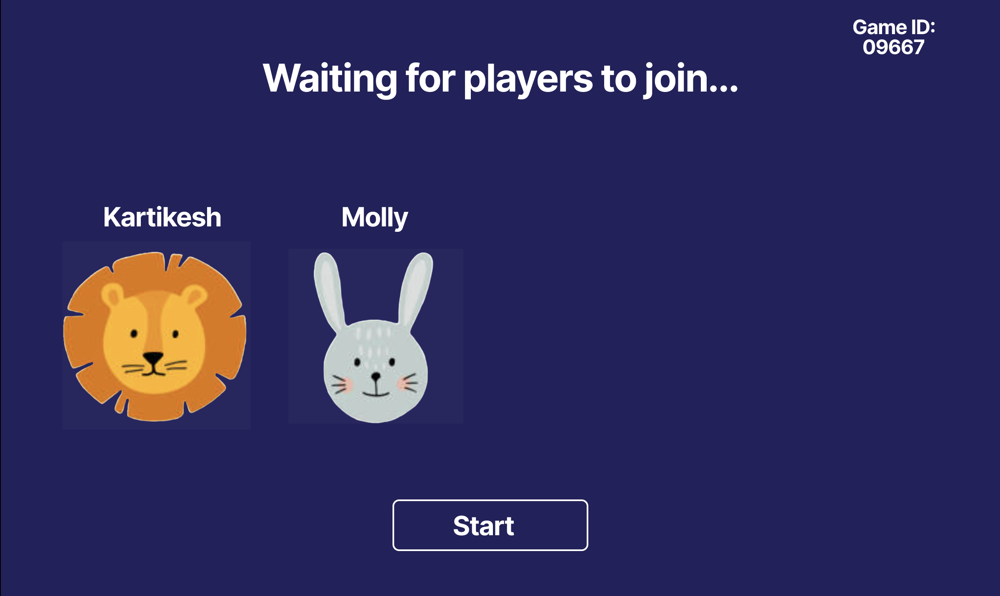
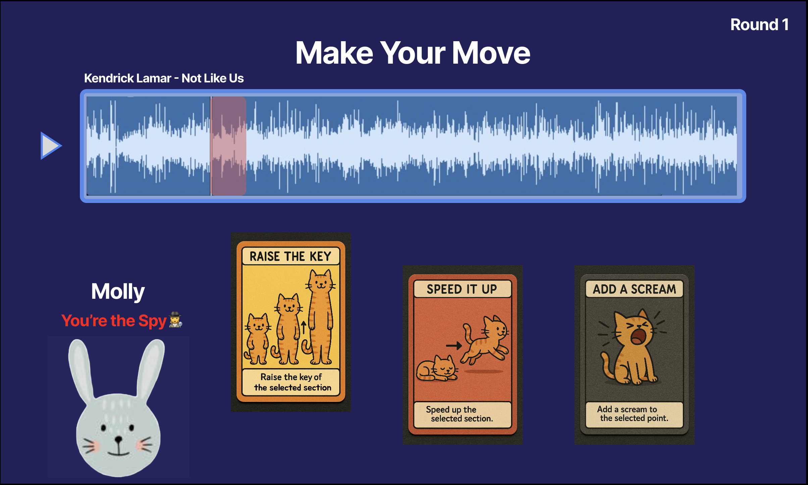
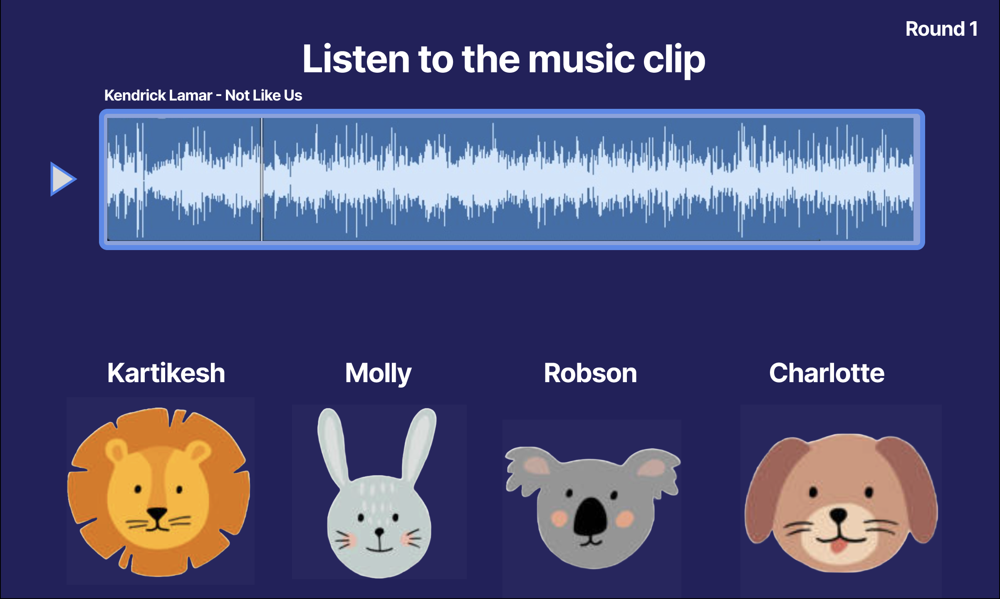
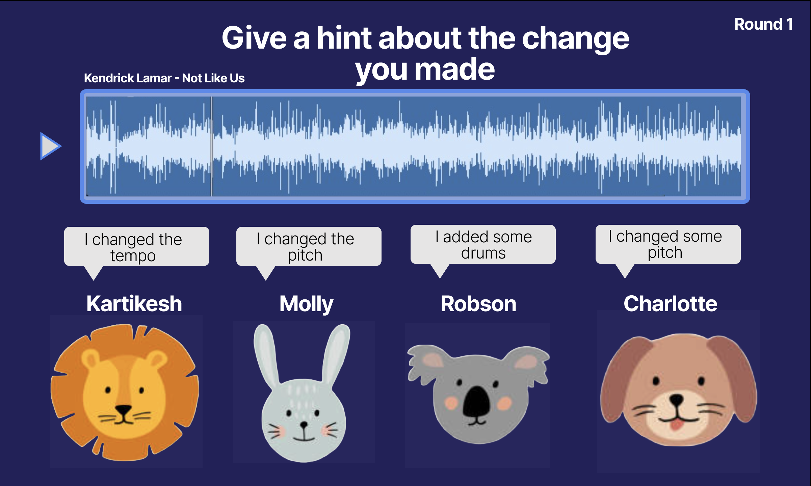
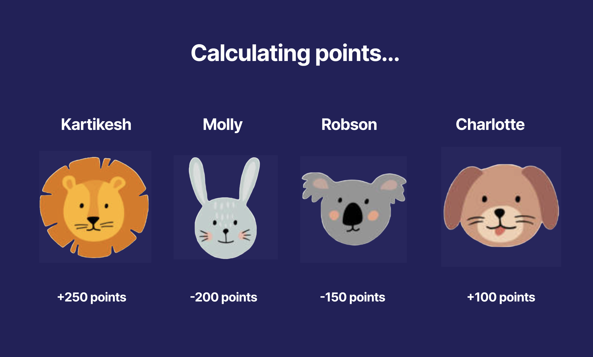
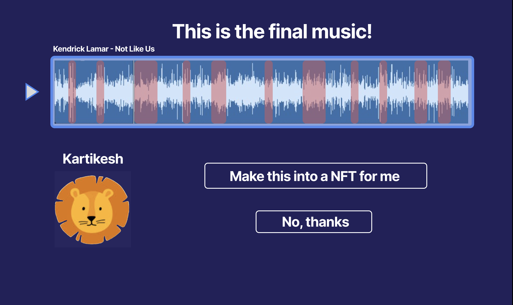
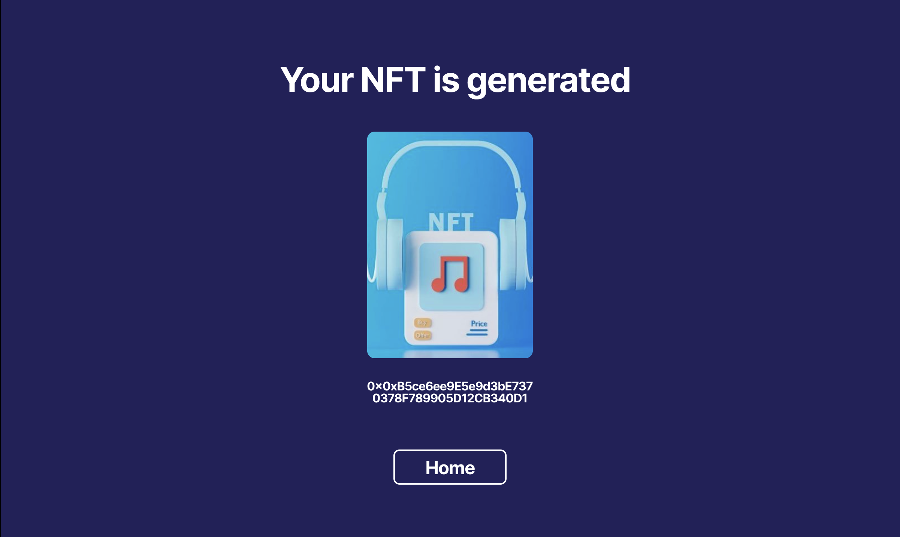

# SoundSpy 🎶🕵️

**Short Summary:**  
A social music editing and spy game built fully on Polkadot Asset Hub using custom smart contracts!

---

## Full Description

**Problem it solves:**  
Music creation and collaboration are often limited to professional tools and lack playful, social interaction.  
SoundSpy brings social creativity by letting multiple players cooperatively edit a music piece — while one secretly tries to sabotage it!  
The challenge: Can you identify the spy before your song gets ruined?

**How Polkadot Asset Hub helped:**

- We use Polkadot's smart contract functionality to manage contests, track players, and store contest lifecycle securely and trustlessly.
- Thanks to Polkadot Asset Hub, players can participate without centralized servers, and the final music edits can be minted as NFTs.

---

## Technical Description

**Smart Contract:**

- Built using Solidity for EVM compatibility on Polkadot Asset Hub (through EVM-pallet).
- Custom contract logic manages:
  - Contest creation
  - Player joins
  - Spy assignment
  - Round voting and scoring
  - Final winner selection

**SDKs and Libraries Used:**

- `ethers.js` for smart contract interaction
- `React` + `TypeScript` frontend
- `Vite` build system
- `TailwindCSS` for UI
- `useEffect`, `useContext` React hooks for web3 and audio state
- `OfflineAudioContext` API for browser-based music editing
- `React Router` for clean page navigation

**Why Polkadot made this uniquely possible:**

- Polkadot Asset Hub’s EVM support allows running custom Solidity contracts seamlessly.
- Low transaction fees made it realistic to update game states frequently (e.g., player votes, round updates).
- Polkadot's decentralized finality provides an honest, tamper-proof game outcome.

---

## Demo Video 🎥

👉 [Watch our Demo Video](https://youtu.be/uBPdmIjG4yA)

_In this video, we show:_

- Uploading music
- Creating a contest
- Joining and playing rounds
- Voting for the spy
- Ending a contest and declaring a winner
- Smart contract transaction confirmations

---

## Explanation Video with Audio 🎥

👉 [Watch our Demo Video](https://www.youtube.com/watch?v=yKHXc1XaPXo)

_In this video, we show:_

- Explain the project
- Show the demo

---

## Screenshots 🖼

|                      Landing                       |                    Waiting Room                    |                    Playing Game                    |                   Listening to the Music                   |                      Hint                       |                      Calculating Points                       |                      Final Music                       |                    Your NFT                    |
| :------------------------------------------------: | :------------------------------------------------: | :------------------------------------------------: | :--------------------------------------------------------: | :---------------------------------------------: | :-----------------------------------------------------------: | :----------------------------------------------------: | :--------------------------------------------: |
|  |  |  |  |  |  |  |  |

## Smart Contract

- Custom-built, fully open source
- No templates, no boilerplate: Entire contest logic is self-coded
- Stored on Polkadot Asset Hub EVM
- Contract Repository: [View Smart Contract Code Here](./contracts)

---

## Contract Block Explorer Link

🔗 [View Deployed Game Contract on Polkadot Asset Hub Block Explorer](https://polkadot-explorer-link-here.com/0xC03B5d3895F9a9b9a47993a73569F13cb443eeA8)
🔗 [View Deployed NFT Contract on Polkadot Asset Hub Block Explorer](https://polkadot-explorer-link-here.com/0x0EdBFbB852751836BcEC638067D1A04C9B4F011d)

---

## Presentation Slides (Required - Canva Link)

👉 [Our Canva Presentation](https://www.canva.com/design/DAGlzOT36Uw/yLNuv1i6oLdidDRanDLTyg/edit)

Slides include:

- Problem Statement
- Target Audience
- How SoundSpy Works
- Technical Architecture
- Screenshots
- Our Team

---

## How this Repository is Structured

| Folder                            | Description                                            |
| :-------------------------------- | :----------------------------------------------------- |
| `/contracts/`                     | Smart contracts (Solidity)                             |
| `/frontend/src/contexts/`         | Ethereum connection and Context                        |
| `/frontend/src/libs/contracts`    | smart contract hooks                                   |
| `/frontend/src/libs/audio_editor` | Custom AudioEditor.ts to manipulate audio browser-side |
| `/public/screenshots/`            | Screenshots for presentation and README                |
| `/README.md`                      | This file                                              |

---

## Team

| Member | Role                                                       |
| :----- | :--------------------------------------------------------- |
| You    | Smart Contract Developer, Frontend Developer, Sound Editor |

---

## Open Source

✅ This repository is, and will remain, fully open source under the MIT License.

---

# Thank you for visiting SoundSpy! 🚀🎶
